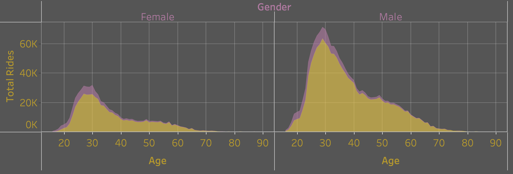
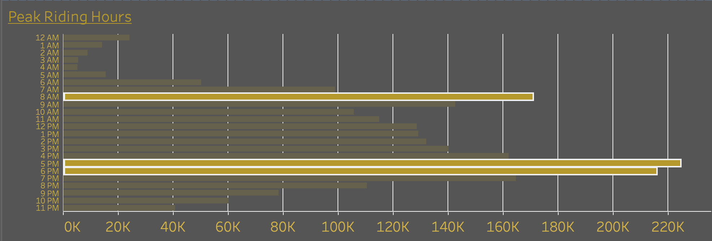
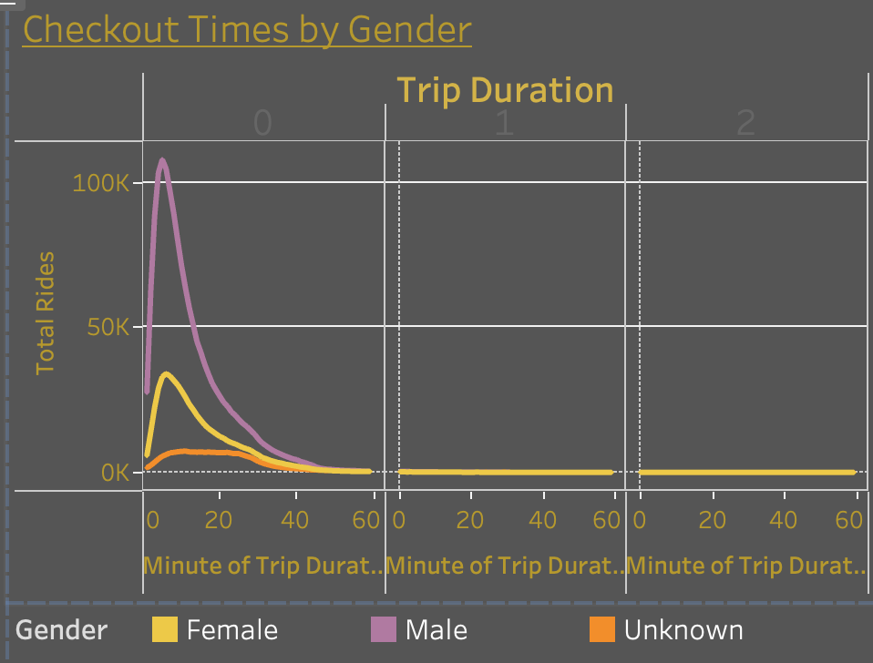

# Module 15 Bikesharing

### Of note:
---
Due to the space requirements, and git-lfs not functioning properly, the .csv files have been added to the .gitignore, and not added to this repo. Upon completion of the code, however, the .csv files will be produced, and the code is good.
Thank you.   
   
---

## Overview   
---
The project's aim was to provide a detailed analysis of the CitiBike Bike Sharing Program in NYC in order to determine if a similar program could work in Des Moines, IA.   
   
---
### Analysis
---
The data showed that the primary customer base is Males in their 20's and 30's.    

Ride times and distances travelled are quite short, in general, with the a large amount of the check-out times happening between 8-9 am, and 5-7 pm.   
    
     
   
---   
### Conclusion:
---   
A bikesharing program in Des Moines can absolutely, albeit on a smaller scale.